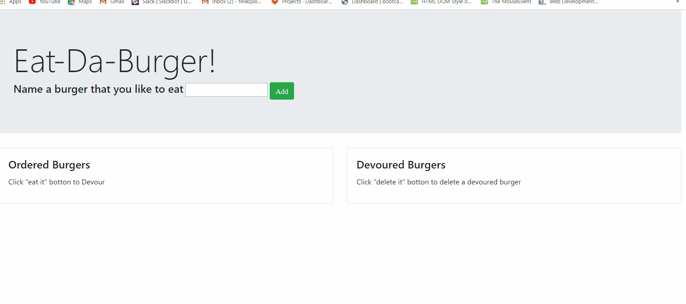

# Burger app

The application is a restaurant app that lets users input the names of burgers they'd like to eat.

# Heroku access link

https://salty-plains-14150.herokuapp.com/

# Repository access link

https://github.com/Ravil822/Burger.git

## How to Use
1. Run NPM INSTALL in the terminal
2. Run NODE SERVER.JS

# Demo

# Terms

THE SOFTWARE IS PROVIDED "AS IS", WITHOUT WARRANTY OF ANY KIND, EXPRESS OR IMPLIED, INCLUDING BUT NOT LIMITED TO THE WARRANTIES OF MERCHANTABILITY, FITNESS FOR A PARTICULAR PURPOSE AND NONINFRINGEMENT. IN NO EVENT SHALL THE AUTHORS OR COPYRIGHT HOLDERS BE LIABLE FOR ANY CLAIM, DAMAGES OR OTHER LIABILITY, WHETHER IN AN ACTION OF CONTRACT, TORT OR OTHERWISE, ARISING FROM, OUT OF OR IN CONNECTION WITH THE SOFTWARE OR THE USE OR OTHER DEALINGS IN THE SOFTWARE.